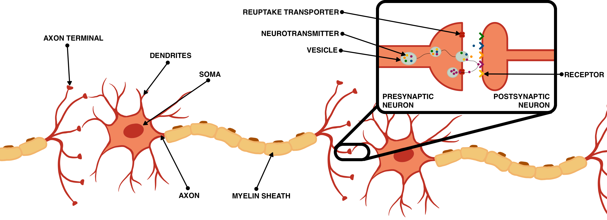

# Balancing Reliability towards Discrimination-aware Convolutional Spiking Neural Network through Bayesian Optimization

Real-world problems are often embedded in highly imbalanced contexts that traditional machine learning algorithms aim to address. However, these models frequently lack fairness, especially toward sensitive attributes, leading to biased classifications. This issue becomes even more critical as the energy demand of training these algorithms on graphical processing units (GPUs) has risen exponentially in recent years, surpassing the energy consumption of some smaller countries. Our research introduces a 1D-convolutional spiking neural network (SNN) modeling and optimization approach designed for highly imbalanced real-world problems to address these challenges. SNNs are known for their sensitivity to hyperparameters, often limiting their performance. To overcome this, we propose a robust optimization process that mitigates these limitations. As a result, our convolutional spiking models outperform traditional non-spiking algorithms in terms of performance, fairness, and energy efficiency. They can consume significantly less energy and power when implemented on neuromorphic hardware. By presenting this framework, we propose a responsible and sustainable solution for addressing real-world problems. Our approach not only advances the performance of SNN models but also contributes to reducing their environmental impact, promoting fairness, and paving the way for practical applications in highly imbalanced scenarios.

**Keywords:** Spiking Neural Networks $\cdot$ Bayesian Optimization $\cdot$ Neuromorphic Computing $\cdot$ Highly Imbalanced Data $\cdot$ Responsible AI $\cdot$ Sustainable AI




## Installation

To install the required packages, run the following command:
```bash
pip install -r requirements.txt
```
Download the six Variant of the Bank Account Fraud (BAF) Dataset and extract the parquet files to the data folder.

## Dataset

The Bank Account Fraud (BAF) dataset is a synthetic dataset based on real-world data that simulates bank account opening applications. The dataset contains 6 parquet files, each representing a different variant of the dataset (Base, Variant I, Variant II, Variant III, Variant IV, and Variant V). It contains 30 features and a binary target variable indicating whether the application is fraudulent or not.
